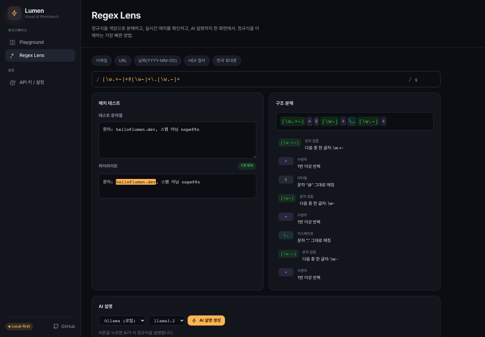
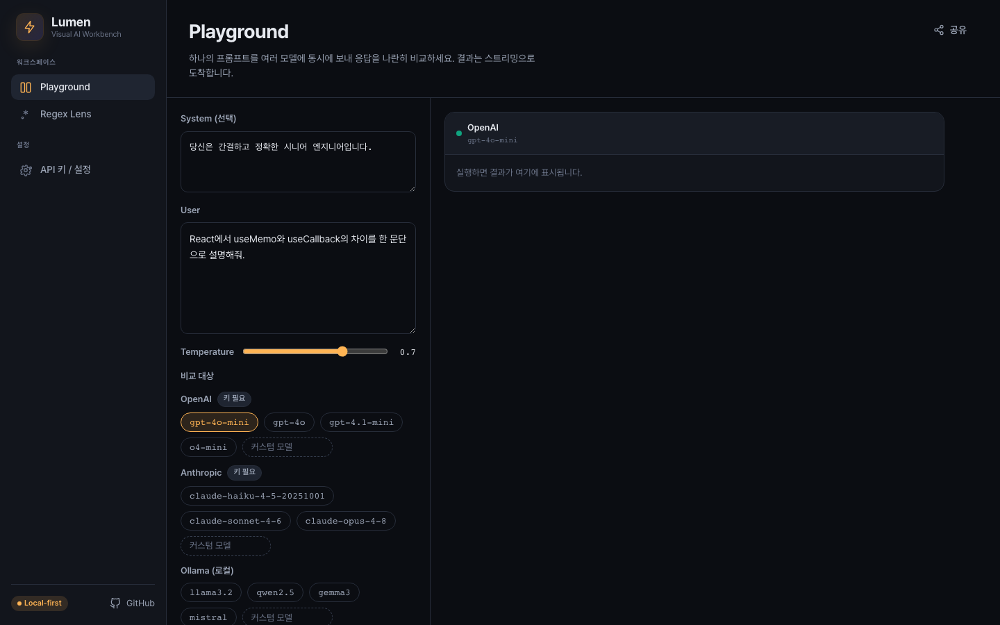

<div align="center">

# ⚡ Lumen

### A local-first **visual AI workbench** for developers

Compare multiple LLMs side-by-side, and *see* what your code actually does — all in your browser, with your own keys.

[](./LICENSE)
[](https://react.dev)
[](#-privacy--local-first)
[](#-contributing)

</div>

---

> **TL;DR** — Lumen is an open-source, local-first toolkit that turns raw chat boxes into purpose-built *visual surfaces* for developers.
> The **Playground** fans one prompt out to OpenAI, Anthropic, and local Ollama models at once and streams the answers side-by-side.
> **Lenses** dissect dev artifacts visually — the first one decomposes any **regex** into a colour-coded structure with live match highlighting and an AI explanation.
> No backend, no sign-up, no telemetry. Your API keys never leave your browser.

<div align="center">



<sub>**Regex Lens** — colour-coded structure, live match highlighting, and an AI explanation in one view.</sub>



<sub>**Playground** — one prompt, every model, streamed side-by-side.</sub>

</div>

## ✨ Features

### 🔬 Playground — one prompt, every model
- Send a single prompt to **multiple providers and models simultaneously**.
- Responses **stream in parallel**, rendered side-by-side for instant comparison.
- Per-result **latency and token usage**, one-click copy.
- **Save** prompts into a local collection and **share** an entire setup via a single URL (state is encoded in the link — nothing is uploaded).

### 🔍 Regex Lens — understand any regex in seconds
- **Deterministic tokenizer** breaks a pattern into colour-coded pieces (anchors, groups, quantifiers, character classes…) with a plain-language description for every token.
- **Live match highlighting** against your own test string, updated as you type.
- **AI explanation** layered on top — summary, behaviour, and matching/non-matching examples — powered by the same provider engine.
- Built-in presets (email, URL, date, hex colour, phone) so it's useful the moment you open it.

### 🔒 Privacy & local-first
- **Zero backend.** Requests go straight from your browser to each provider.
- API keys are stored **only** in your browser's `localStorage` and are never transmitted anywhere except the provider you call.
- Works fully offline with [Ollama](https://ollama.com) — no cloud account required.

## 🤔 Why Lumen?

Developers increasingly juggle several models — GPT for one task, Claude for another, a local model for privacy. But comparing them means copy-pasting between tabs, and tools like a raw chat box don't help you *understand* a tricky regex or command.

Lumen reframes the problem: instead of one generic chat box, it offers **specialized, visual surfaces** — a comparison Playground and a growing library of **Lenses** — all sharing one clean provider abstraction. It's the difference between a calculator and a spreadsheet.

## 🚀 Quick start

```bash
# 1. clone
git clone https://github.com/yeo11200/open-ai-codex-open-source.git
cd open-ai-codex-open-source

# 2. install
npm install

# 3. run
npm run dev        # http://localhost:5173
```

Then open **Settings → API keys** and paste a key for any provider you want to use
(or just point Lumen at a local Ollama instance — no key needed).

```bash
npm run build      # type-check + production build → dist/
npm run preview    # serve the production build locally
```

### Bring Your Own Key (BYOK)

| Provider  | Needs a key?            | Where to get one |
| --------- | ----------------------- | ---------------- |
| OpenAI    | ✅ yes                  | <https://platform.openai.com/api-keys> |
| Anthropic | ✅ yes                  | <https://console.anthropic.com/settings/keys> |
| Ollama    | ❌ no (runs locally)    | <https://ollama.com> |

> **Browser CORS note** — OpenAI and Anthropic are called with their official "direct browser access" headers. For Ollama, set `OLLAMA_ORIGINS="*"` (or your dev origin) so the local server accepts browser requests.

## 🧱 Architecture

The heart of Lumen is a **provider-agnostic streaming abstraction**. Every model — regardless of its wire format (SSE vs. NDJSON) — is normalised behind a single `LlmProvider` interface, so feature code never touches provider details.

```
src/
├── lib/providers/        # ★ LlmProvider interface + OpenAI / Anthropic / Ollama adapters
│   ├── types.ts          #   shared contract (streaming chat, usage, credentials)
│   ├── stream.ts         #   common line/SSE reader
│   └── provider-registry.ts  # add a provider in one line → it appears everywhere
├── features/
│   ├── playground/       # multi-model compare (runner hook + result columns + collections)
│   ├── regex-lens/       # tokenizer + matcher + AI explainer
│   └── settings/         # BYOK key management
├── components/           # common UI + AppShell layout
├── store/                # Zustand slices (settings, playground) with localStorage persistence
└── styles/               # design tokens (single source of truth)
```

**Adding a new provider** is a three-step change: implement `LlmProvider`, register it, done — the Playground, Lens picker, and Settings screen all pick it up automatically.

## 🛣️ Roadmap

Lumen is built as an extensible **lens platform**. Planned lenses & features:

- [ ] **Cron Lens** — visualise and explain cron expressions
- [ ] **Git Lens** — decode unfamiliar git commands
- [ ] **jq / SQL Lens** — break down data-query expressions
- [ ] Prompt **versioning & diff** in the Playground
- [ ] **Token-level diff** between model outputs
- [ ] Streaming **markdown rendering** for AI explanations

Contributions toward any of these are very welcome — see below.

## 🧰 Tech stack

**React 19** · **TypeScript** (strict, `verbatimModuleSyntax`) · **Vite 8** · **Zustand** · **React Router** · **SCSS Modules** · zero runtime UI dependencies.

## 🤝 Contributing

Issues and PRs are welcome. The codebase follows a strict feature-folder structure with barrel exports and a single design-token source — please match the surrounding conventions. A good first contribution is **a new Lens** (the regex lens is a complete reference implementation).

## 📄 License

[MIT](./LICENSE) © 2026 Jinseop Shin (신진섭)

---

<div align="center">
<sub>Made for developers who want to <strong>see</strong>, not just chat. ⚡</sub>
</div>
